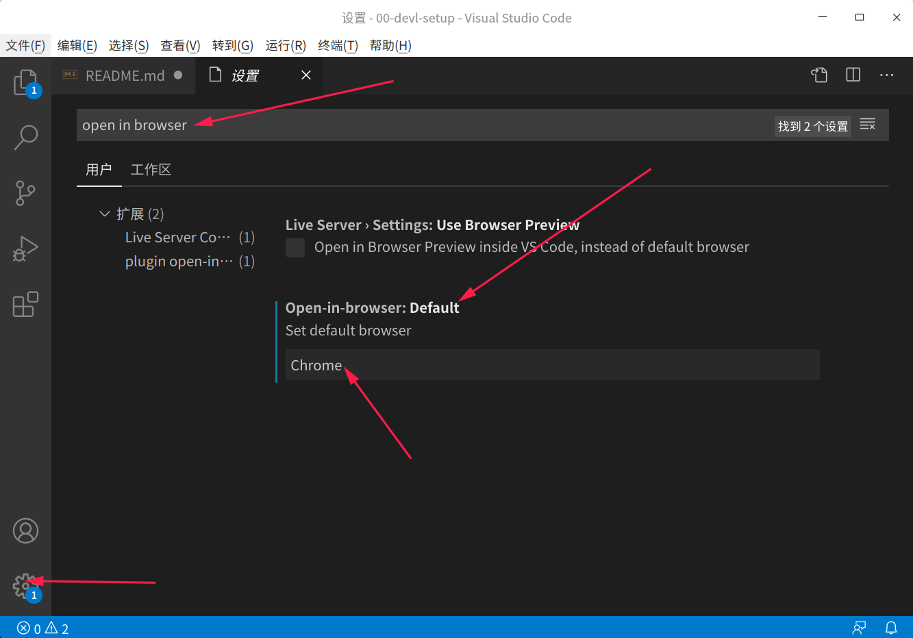
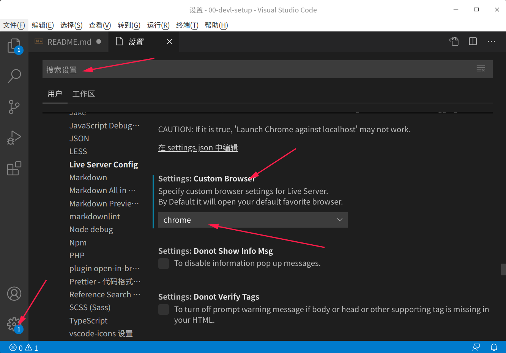

# web开发环境搭建 Linux发行版 deepin v20

- [web开发环境搭建 Linux发行版 deepin v20](#web开发环境搭建-linux发行版-deepin-v20)
  - [01 VS Code](#01-vs-code)
  - [02 git](#02-git)
  - [03 node.js](#03-nodejs)

---

## 01 VS Code

1. 插件安装清单

   - (1). Chinese (Simplified) Language Pack for Visual Studio Code
   - (2). Live Server
   - (3). Markdown All in One
   - (4). markdownlint
   - (5). open in browser
   - (6). Markdown Preview Enhanced
   - (7). vscode-icons

1. 默认浏览器设置

   - (1). 设置 -> 输入 `open in browser` -> chrome

    

   - (2). 设置 -> 输入`Liver Server` -> 选择chrome

    

## 02 git

1. 安装

   - (1). 操作: `ctrl + alt + t`打开命令行终端, 输入`sudo apt install git`
   - (2). 查询git版本,验证是否安装成功:`git --version`

## 03 node.js

1. 安装

   - (1). 准备: 官网下载nodejs包[注意: 是.tar.g后缀编译后的文件包, 不要下载源码包, 并且对应系统版本, 我的是64-bit]
   - (2). 原理: 简单说就是解压后, 在bin文件夹中已经存在node以及npm, 如果你进入到对应文件的中执行命令行一点问题都没有, 不过不是全局的, 所以将这个设置为全局就好了.
   - (3). 操作: 终端命令行输入:

    ```cmd
    # 在当前压缩包下打开命令行终端操作
    tar -xvf node-v14.5.0-linux-x64.tar.xz
    mv node-v14.5.0-linux-x64 /home/kainan/app/software/
    cd /home/kainan/app/software/node-v0.10.28-linux-x64/bin
    ls
    ./node -v
    ```

    这就妥妥的了，node文件夹具体放在哪，叫什么名字随你怎么定。然后设置全局：

    ```cmd
    mv /home/kainan/app/software/node-v0.10.28-linux-x64 nodejs
    sudo ln -s /home/kainan/app/software/nodejs/bin/npm /usr/local/bin/
    sudo ln -s /home/kainan/app/software/nodejs/bin/node /usr/local/bin/
    ```

    这里/home/kainan/sofltware/这个路径是你自己放的, 你将node文件解压到哪里就是哪里.
